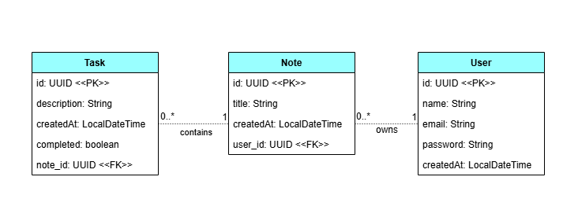

# Smart Notes & Task Manager

This is a backend service for a note-taking application that allows users to manage their own to-do
lists while providing an optional AI-driven feature to break down complex notes into specific tasks.

## Project Overview
The application provides a standard CRUD interface for notes and tasks. 

Users can manually create and manage their checklists, or they can choose to prompt an integrated LLM with
a specific goal. Then the system will suggest a structured list of sub-tasks to achieve that result. 

The goal is to offer a flexible tool where manual organization and AI assistance coexist.

## 🛠 Tech Stack
* **Language:** Java 17
* **Framework:** Spring Boot 3
* **Database:** PostgreSQL 18.1
* **Persistence:** Spring Data JPA / Hibernate
* **Primary Keys:** UUID (v4)
* **Boilerplate reduction:** Lombok

## System Architecture
The project follows a standard **Layered Architecture** (Controller, Service, Repository, Entity).
This ensures that the business logic for AI task generation remains decoupled from the database access and the REST API.

### Database Design
The schema is designed for relational integrity and security:
* **UUIDs:** All entities use UUIDs instead of integers to prevent predictable resource IDs.
* **Cascading:** Notes and tasks are linked with `ON DELETE CASCADE` to ensure orphaned records are cleaned up automatically.
* **Auditing:** `createdAt` timestamps are managed automatically by JPA.

The class diagram of the Domain model is shown in the figure below:



### Schema Implementation
The database implementation in PostgreSQL uses `TEXT` for task descriptions to accommodate varying lengths
of content generated by the user or the AI.

```sql
CREATE TABLE tasks (
    id UUID PRIMARY KEY DEFAULT gen_random_uuid(),
    description TEXT NOT NULL,
    completed BOOLEAN NOT NULL DEFAULT FALSE,
    note_id UUID NOT NULL REFERENCES notes(id) ON DELETE CASCADE,
    created_at TIMESTAMP NOT NULL DEFAULT CURRENT_TIMESTAMP
);
```

### Design Patterns

#### Manual Builder Implementation

I have chosen to implement the Builder Pattern manually within the entities for educational purposes. 
This provides a clear and readable way to instantiate objects—especially when mapping complex data from the AI service 
without relying on hidden generated code for the core domain logic.

🔽  Current Status
* [x] PostgreSQL Schema Design (UUID based)

* [x] JPA Entity Mapping

* [x] Manual Builder Implementation

* [ ] Repository Layer Implementation

* [ ] REST API Endpoints

* [ ] **Post-MVP:** AI Integration Service


---
#### Developed by Eylen Sofia Montiel


